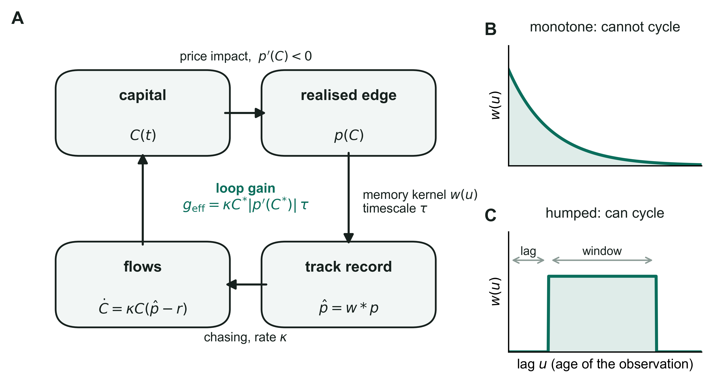

# The Memory of Money

**Track-record windows and whether crowding cycles.**

[](https://doi.org/10.5281/zenodo.22077602)
[](LICENSE)
[](https://www.python.org/)
[](#reproducibility)

Replication package for a working paper by **Akash Deep**. Every number, table and figure
in the paper is produced by the scripts in [`code/`](code); nothing is hand-computed.

---

## What the paper is about

Capital chases a track record. The track record is a weighted history of past returns, and
the weights are set by evaluation conventions: a trailing three-year Sharpe ratio, a star
rating, a consultant's screen. Capital that arrives erodes the very edge it chased. That is
a feedback loop with a lag, and lagged feedback loops either settle or oscillate.

The paper's result is that **which one happens is decided by the *shape* of the memory, not
by its length or by how aggressively capital chases.**



Memory that weights the freshest data most heavily — exponential discounting — can never
sustain a cycle, at any gain. Memory that discounts the recent past relative to older data
— a trailing window, or a window reached only after a reporting delay — cycles once a
single dimensionless gain crosses a threshold the kernel itself sets. The period at onset
is two to four times the window.

The rest of the paper measures the two things that theorem says matter. Read as estimates
of a memory kernel, the fund-flow literature says retail money has the safe shape and
institutional money has the dangerous one, and the dangerous share has been growing. On
managed futures — the one strategy whose capital is publicly recorded — the estimated
kernel peaks at three years, and the loop gain is 0.18, an order of magnitude below
threshold.

---

## Quickstart

The theoretical results need no data at all. Clone and run:

```bash
git clone https://github.com/akashdeepo/Memory_of_Money.git
cd Memory_of_Money

python -m venv .venv
source .venv/bin/activate          # Windows: .venv\Scripts\activate
pip install -r requirements.txt

python code/e001e_boxlag_thresholds.py   # reproduces the stability thresholds
python code/e001_decay.py                # verifies them by simulation, writes figures
```

The first finishes in about a second and prints the threshold table two independent ways.
The second integrates the delay equations and locates each bifurcation by bisection; it
takes a few minutes and writes its figures to `fig/`.

Everything under [Theory](#theory) below runs the same way, with no data. The empirical
scripts additionally need the files described under [Data](#data).

---

## Repository layout

```
code/         analysis and simulation scripts (see the tables below)
data/         SignalDoc.csv; instructions for obtaining everything else
figures/      the ten figures as they appear in the paper, 600 dpi
requirements.txt            minimum versions
requirements-frozen.txt     exact versions used for the published results
```

---

## What produces what

### Theory

Runs with no data.

| Paper object | Script |
|---|---|
| Stability thresholds, window-plus-lag rows | `e001e_boxlag_thresholds.py` |
| Stability thresholds, closed-form rows; numerical verification | `e001_decay.py` |
| Impact-law independence; saturating-impact thresholds | `e001c_saturating.py` |
| Two-species thresholds and regime map | `e002_tugofwar.py` |
| Conservation law, three ways | `e002_verify_D2.py` |
| Compounding-bankroll coexistence | `e003_bankroll.py` |
| Ensemble averaging under a pure lag | `e001b_averaging.py` |
| Ensemble averaging under a trailing window | `e001d_audit_kernel.py` |
| Power of the pooled spectral test | `e005_power.py` |
| The schematic above | `fig_loop_schematic.py` |

### Empirics

Needs the data described below.

| Paper object | Script | Data |
|---|---|---|
| Managed-futures kernel and gain, point estimates | `e005b_cta_kernel.py` | managed futures |
| The same, bootstrap intervals | `e005c_cta_bootstrap.py` | managed futures |
| Publication-aligned event study | `e004_undershoot.py` | anomaly panel |
| Placebo-portfolio check | `e004b_placebo.py` | anomaly panel |
| Calendar-month fixed effects | `e004c_calendar.py` | anomaly panel |
| Predictors against placebos | `e004d_did.py` | anomaly panel |
| Cross-sectional regression | `e004e_crowdability.py` | anomaly panel |
| Publication-vintage split | `e004f_cohort.py` | anomaly panel |

`cta_data.py` holds the series loading and model specification shared by the two
managed-futures scripts, so both work from an identical sample and specification.

### Regenerating every figure

```bash
python code/_regen_pdf.py e001_decay.py e001b_averaging.py e001d_audit_kernel.py \
    e002_tugofwar.py e004_undershoot.py e004d_did.py e005b_cta_kernel.py
python code/export_journal_figures.py figures
```

The first writes each figure as a PNG with a vector PDF alongside; the second collects
them in paper order and reports the resolution of each.

---

## Data

Only freely redistributable data is included. The vendor series are **not** redistributed,
because their providers do not grant redistribution rights — the usual arrangement for
vendor data in finance. It costs nothing in reproducibility: every step from the raw files
onward is in `code/`, and [`data/README.md`](data/README.md) gives the retrieval steps and
the exact layout each file is expected to have, so you can confirm a newer vintage still
parses before running anything.

| Source | Included | Needed by |
|---|---|---|
| Open Source Asset Pricing — `SignalDoc` | yes | `e004*` |
| Open Source Asset Pricing — predictor and placebo portfolios | no, `pip install openassetpricing` | `e004*` |
| BarclayHedge — CTA assets under management, BTOP50 index | no, barclayhedge.com | `e005b`, `e005c` |
| AQR Data Library — Time Series Momentum Factors | no, AQR Data Library | `e005b`, `e005c` |

---

## Reproducibility

Every script that uses randomness seeds its generator explicitly, so bootstrap intervals
and simulated ensembles reproduce exactly on the same package versions. Threshold-finding
is deterministic.

Two scripts check themselves against the paper as they run.
`e001e_boxlag_thresholds.py` derives each threshold in closed form *and* by root-finding on
the unwrapped phase, with no shared algebra between the two routes, and asserts they agree
(they do, to 2 × 10⁻¹⁶). `e005c_cta_bootstrap.py` prints its recomputed intervals next to
the ones published in the paper, row by row, so any divergence is visible without opening
the paper.

Reported bifurcation thresholds carry a small upward bias from finite integration time.
That is the signature of critical slowing down near a bifurcation, discussed in the paper,
not a numerical error.

Python 3.13.3 was used for the published results; any Python ≥ 3.11 should work.

---

## Citing

If you use this code, please cite the archived release:

> Deep, A. (2026). *"The Memory of Money: Track-Record Windows and Whether Crowding
> Cycles" — Replication Package* (v1.0.0). Zenodo. https://doi.org/10.5281/zenodo.22077602

A BibTeX entry and machine-readable metadata are in [`CITATION.cff`](CITATION.cff); GitHub
renders a "Cite this repository" button from it. Please also cite the paper itself, which
is a working paper under review; that citation will be added here when it appears.

---

## License

Code is released under the [MIT License](LICENSE). Data files retain the licenses of their
original providers; see [`data/README.md`](data/README.md).
